# System Design Documentation

## Overview

This is a modern, production-ready fullstack application built with a **monolithic architecture** approach, containerized using Docker for development and deployment consistency. The system follows a traditional three-tier architecture pattern with clear separation between presentation, business logic, and data layers, optimized for rapid development and maintainability.

## System Architecture

```mermaid
graph TD
    %% External Users
    U[👤 Users] --> LB[Load Balancer/Reverse Proxy]
    
    %% Frontend Layer
    LB --> FE[🌐 React Frontend<br/>Port 3000<br/>Vite + TypeScript]
    
    %% API Gateway/Backend
    FE -->|HTTP/REST API| BE[⚙️ NestJS Backend<br/>Port 5000<br/>JWT Auth + RBAC]
    
    %% Database Layer
    BE -->|TypeORM| DB[(🗄️ PostgreSQL<br/>Port 5432<br/>Persistent Storage)]
    
    %% External Services (Future)
    BE -.->|Future Integration| EXT[📧 External Services<br/>Email, File Storage, etc.]
    
    %% Docker Network
    subgraph Docker["🐳 Docker Network (fullstack_network)"]
        FE
        BE
        DB
    end
    
    %% Data Flow Annotations
    FE -->|User Actions| BE
    BE -->|API Responses| FE
    BE -->|SQL Queries| DB
    DB -->|Query Results| BE
    
    %% Health Checks
    FE -.->|Health Check| FE
    BE -.->|Health Check| BE
    DB -.->|pg_isready| DB
    
    %% Volume Persistence
    DB --> VOL[💾 Named Volume<br/>postgres_data]
    
    style U fill:#e1f5fe
    style FE fill:#f3e5f5
    style BE fill:#e8f5e8
    style DB fill:#fff3e0
    style Docker fill:#f5f5f5,stroke:#666,stroke-dasharray: 5 5
    style VOL fill:#ffebee
```

## Component Breakdown

### Frontend Layer (React.js)
The **React 18 frontend** serves as the presentation layer, built with **TypeScript** and **Vite** for optimal development experience and build performance. It implements a **Single Page Application (SPA)** architecture with client-side routing using React Router. The frontend handles user authentication state management, role-based UI rendering, and real-time API communication through **React Query** for efficient server state management. **Tailwind CSS** provides utility-first styling with responsive design patterns, while **Lucide React** delivers consistent iconography. The application features role-specific dashboards (Student, Lecturer, Admin), course management interfaces, and an AI assistant chat system with form-based interactions.

### Backend Services (NestJS)
The **NestJS backend** implements a **modular monolithic architecture** with clear separation of concerns through modules, services, and controllers. It provides **RESTful API endpoints** with comprehensive **JWT-based authentication** and **Role-Based Access Control (RBAC)** supporting three user roles: Student, Lecturer, and Admin. The backend leverages **TypeORM** for database abstraction and entity management, implementing sophisticated features like course enrollment, assignment grading, and AI-powered recommendation systems with mock data. **Passport.js** handles authentication strategies, while **class-validator** ensures robust input validation and data transformation. The architecture supports horizontal scaling through stateless design and database connection pooling.

### Database Design (PostgreSQL)
The **PostgreSQL database** implements a **relational data model** optimized for educational management systems. Core entities include Users (with role-based permissions), Courses, Enrollments, Assignments, and AssignmentSubmissions, all connected through well-defined foreign key relationships. The database uses **UUID primary keys** for enhanced security and distributed system compatibility. **TypeORM migrations** manage schema evolution, while **named Docker volumes** ensure data persistence across container lifecycles. The design supports complex queries for grade calculations, enrollment tracking, and user management with proper indexing for performance optimization.

## Key Architectural Decisions

### **Monolithic vs Microservices Choice**
We chose a **monolithic architecture** to optimize for development velocity and operational simplicity. This approach reduces complexity in service communication, data consistency, and deployment orchestration while maintaining clear module boundaries that could support future microservices migration if needed.

### **Containerization Strategy**
**Docker Compose** orchestrates the entire development environment with service dependency management, health checks, and hot reload capabilities. This ensures consistent environments across development, testing, and production while simplifying onboarding and deployment processes.

### **Authentication & Security**
**JWT-based stateless authentication** enables horizontal scaling without session storage dependencies. **Role-Based Access Control (RBAC)** provides granular permission management, while **bcryptjs password hashing** and **input validation** ensure security best practices throughout the application.

### **Technology Stack Rationale**
- **TypeScript** across the entire stack ensures type safety and improved developer experience
- **React Query** eliminates complex state management for server data
- **TypeORM** provides database abstraction while maintaining SQL flexibility
- **Tailwind CSS** accelerates UI development with consistent design patterns
- **PostgreSQL** offers robust ACID compliance and advanced querying capabilities for educational data